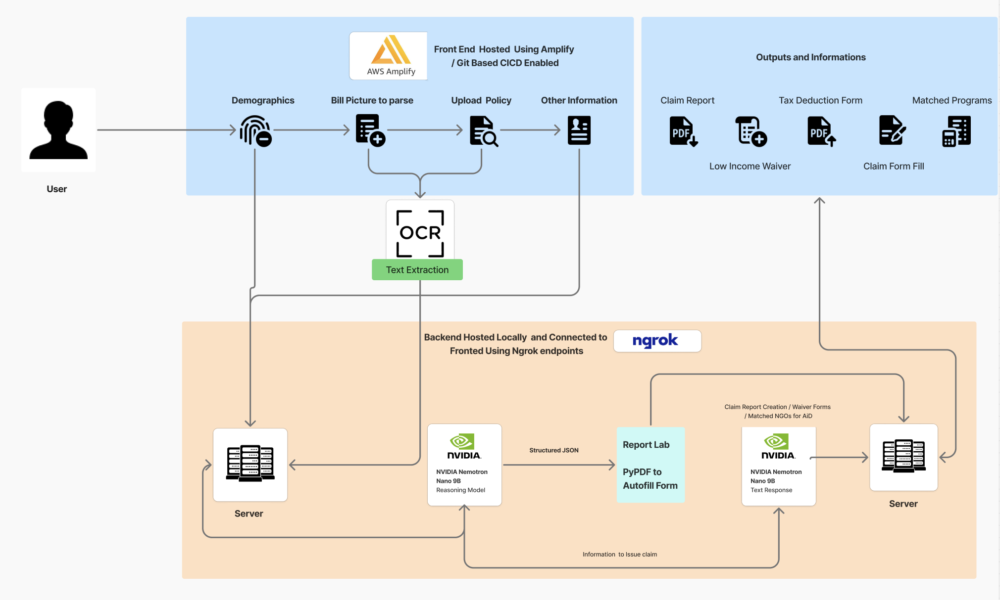

# TrueClaim.AI  

## 🎯 Challenge Statements Addressed  
- How might we help individuals navigate complex insurance claim processes and reduce medical debt burden?  
- How might we automate and simplify the insurance claims filing process using AI technology to make healthcare more accessible?  
- How might we reduce the **41% insurance claim denial rate** by improving claim accuracy and completeness? 
- Hospitals and health systems spent about 19.7 billion dollars trying to overturn denied claims every year
- Denials hit higher cost care harder, with the average denied claim tied to charges of 14,000 dollars or more
- Around 15 percent of claims sent to private insurers are denied at first, even when some were already preapproved during prior authorization
- Initial denial rates are roughly 15.7 percent for Medicare Advantage claims and 13.9 percent for commercial claims
- Most denials are not final decisions. About 89 % are eventually overturned, but only after multiple rounds of expensive appeals
- Denials are not just a health insurance problem. In homeowner insurance, some large insurers reportedly closed about 40 to 51 percent of claims without paying
- A major driver across sectors is administrative and documentation errors, not the claim being invalid
- This is why I want to build InsureRight: to reduce preventable denials, catch paperwork mistakes, guide people through the process, and help them access the money and support they already paid for when they need it most. 

## Project Description  
**TrueClaim.AI** is an AI-powered platform that streamlines the entire insurance claims process from start to finish.  
Using advanced **Optical Character Recognition (OCR)** and **Large Language Models (LLMs)**, the system automatically extracts key information from medical bills and insurance policy documents, then:  

- Auto-fills claim forms  
- Generates **income waiver** and **tax deduction** documents  
- Matches users with relevant **financial assistance programs**, charities, and NGOs  

Users simply upload their documents and basic details, and the system processes everything in **minutes instead of days**.  

## 🔄 Workflow  

1. Enter demographics and incident details  
2. Upload medical bills and insurance policies  
3. Provide claim history information  
4. Apply for income waivers (if eligible)  
5. Receive fully prepared claim and waiver documents  
6. Review and submit final outputs

## Output 
- Claim Report (PDF): A clear summary of what your policy covers, the incident, the denial reason, and next steps.
- Claim Form: A fully filled out PDF you can send to your insurer.
- Appeal Letter: A personalized letter you can submit to fight a denied claim.
- Waiver/Assistance Letter: For eligible users, a request letter for financial aid or charity support.
- Tax Deduction Form: A PDF summarizing your medical expenses for tax-deduction purposes.
- Aid Program List: A tailored list of charities, hospital programs, and assistance options for you.
- Progress Dashboard: Live updates on where your submission stands from upload to submission.

## System Architecture  
- **Backend:** Python-based pipeline for OCR extraction, LLM-driven reasoning, PDF form filling, and automated document generation  
- **Frontend:** React + TypeScript interface for intuitive navigation, real-time progress tracking, and document previews  

---

## Project Value  
**TrueClaim.AI** empowers individuals and families struggling with insurance paperwork and medical debt.  

## Key Impact Areas  
- Tackles the **41% insurance claim denial rate** in the U.S.  
- Reduces manual claim preparation time from **days to minutes**  
- Increases claim approval accuracy through automated form validation  
- Connects users with **financial assistance programs** for greater accessibility  
- Auto-generates **tax deduction documents**, reducing medical expense burdens  

#### 💡 Measurable Benefits  
- **Time Savings:** Claim processing reduced from **days → minutes**  
- **Error Reduction:** Improved document accuracy and completeness  
- **Financial Relief:** Unlocks hidden assistance and waiver opportunities  
- **Accessibility:** Simplifies an otherwise complex, stressful process  

For low-income families, TrueClaim.AI’s **income waiver assistance** can lead to substantial cost reductions — helping ease the **$220 billion in medical debt** currently affecting Americans

## Tech Overview 💻

* React 18.3.1
* TypeScript
* Vite
* Tailwind CSS
* Flask (Python web framework)
* OpenAI API
* NVIDIA API (Nemotron models)
* Tesseract OCR
* PDF processing libraries (pdfplumber, pypdf, pypdfium2)
* ReportLab (PDF generation)

